## 逻辑架构

```mermaid
graph TD
%% ========== 顶层命令 ==========
    KRAKEN["kraken (root)"] --> DCLI["dcli (Deployment CLI)"]
    KRAKEN --> OCLI["ocli (Operations CLI)"]

%% ========== dcli 子命令树 ==========
    DCLI --> DCLI_K8S["k8s"]
    DCLI --> DCLI_MW["middleware"]

    DCLI_K8S --> K8S_INSTALL["install"]
    DCLI_K8S --> K8S_INIT["init"]
    DCLI_K8S --> K8S_JOIN["join"]
    DCLI_K8S --> K8S_UPGRADE["upgrade"]
    DCLI_K8S --> K8S_RESET["reset"]
    DCLI_K8S --> K8S_CERT["cert"]

    DCLI_MW --> MW_MYSQL["mysql"]
    DCLI_MW --> MW_REDIS["redis"]
    DCLI_MW --> MW_KAFKA["kafka"]

%% ========== ocli 子命令树 ==========
    OCLI --> OCLI_NET["net"]
    OCLI --> OCLI_K8S_DIAG["k8s (diagnose)"]
    OCLI --> OCLI_SYS["sys"]
    OCLI --> OCLI_UTIL["util"]

    OCLI_NET --> NET_DIAG["diagnose"]
    OCLI_NET --> NET_TRACE["trace"]

    NET_DIAG --> DIAG_SVC["service"]
    NET_DIAG --> DIAG_POD["pod-to-pod"]
    NET_DIAG --> DIAG_NODE["node-reach"]

    OCLI_K8S_DIAG --> K8S_POD["pod fault"]
    OCLI_K8S_DIAG --> K8S_NODE["node health"]

    OCLI_SYS --> SYS_TOP["top"]
    OCLI_SYS --> SYS_FD["fd"]
    OCLI_SYS --> SYS_DISK["disk"]

    OCLI_UTIL --> UTIL_B64["b64"]
    OCLI_UTIL --> UTIL_YAML["yaml2json"]

%% ========== 内部实现层 (internal) ==========
    subgraph INTERNAL ["internal/ (Implementation)"]
        DEPLOY["deploy/"] --> EXECUTOR["executor (Local/SSH)"]
        DEPLOY --> INSTALLER["installer"]
        DEPLOY --> CLUSTER["cluster"]
        DEPLOY --> CERT["certificate"]
        DEPLOY --> MW_ENGINE["middleware (helm)"]

        DIAGNOSE["diagnose/"] --> DIAG_SVC_IMPL["service.go"]
        DIAGNOSE --> DIAG_POD_IMPL["podtopod.go"]
        DIAGNOSE --> DIAG_NODE_IMPL["nodereach.go"]
        DIAGNOSE --> DIAG_FAULT["fault.go"]

        NETUTIL["netutil/"] --> PING["ping.go"]
        NETUTIL --> TCPTRACE["tcptrace.go"]
        NETUTIL --> MTU["mtu.go"]

        SYSINFO["sysinfo/"] --> PROC["proc.go"]
        OUTPUT["output/"] --> PRINTER["printer.go"]
    end

%% ========== 公共库层 (pkg) ==========
    subgraph PKG ["pkg/ (Reusable Libraries)"]
        LOGGER["logger/"]
        RATELIMIT["ratelimit/"]
        K8SCLIENT["k8sclient/"]
        HELM["helm/"]
    end

%% ========== 命令与实现的调用关系（虚线） ==========
    K8S_INIT -.-> CLUSTER
    K8S_JOIN -.-> CLUSTER
    K8S_UPGRADE -.-> CLUSTER
    K8S_RESET -.-> CLUSTER
    K8S_INSTALL -.-> INSTALLER
    K8S_INSTALL -.-> EXECUTOR
    K8S_CERT -.-> CERT

    MW_MYSQL -.-> MW_ENGINE
    MW_REDIS -.-> MW_ENGINE
    MW_KAFKA -.-> MW_ENGINE

    DIAG_SVC -.-> DIAG_SVC_IMPL
    DIAG_POD -.-> DIAG_POD_IMPL
    DIAG_NODE -.-> DIAG_NODE_IMPL
    K8S_POD -.-> DIAG_FAULT

    NET_TRACE -.-> TCPTRACE
    NET_TRACE -.-> MTU

    SYS_TOP -.-> PROC
    SYS_FD -.-> PROC
    SYS_DISK -.-> PROC

    UTIL_B64 -.-> PKG
    UTIL_YAML -.-> PKG

%% ========== 内部模块对公共库的依赖（虚线） ==========
    CLUSTER -.-> K8SCLIENT
    CLUSTER -.-> LOGGER
    INSTALLER -.-> EXECUTOR
    MW_ENGINE -.-> HELM
    MW_ENGINE -.-> LOGGER
    DIAG_SVC_IMPL -.-> K8SCLIENT
    DIAG_SVC_IMPL -.-> OUTPUT
    DIAG_FAULT -.-> K8SCLIENT
    NETUTIL -.-> LOGGER
    SYSINFO -.-> LOGGER
    OUTPUT -.-> PKG

%% ========== 样式配置 ==========
    classDef cmd fill:#e1f5fe,stroke:#01579b,stroke-width:2px;
    classDef impl fill:#f3e5f5,stroke:#4a148c,stroke-width:2px;
    classDef pkg fill:#e8f5e9,stroke:#1b5e20,stroke-width:2px;

    class KRAKEN,DCLI,OCLI,DCLI_K8S,DCLI_MW,K8S_INSTALL,K8S_INIT,K8S_JOIN,K8S_UPGRADE,K8S_RESET,K8S_CERT,MW_MYSQL,MW_REDIS,MW_KAFKA cmd;
    class OCLI_NET,OCLI_K8S_DIAG,OCLI_SYS,OCLI_UTIL,NET_DIAG,NET_TRACE,DIAG_SVC,DIAG_POD,DIAG_NODE,K8S_POD,K8S_NODE,SYS_TOP,SYS_FD,SYS_DISK,UTIL_B64,UTIL_YAML cmd;
    class DEPLOY,EXECUTOR,INSTALLER,CLUSTER,CERT,MW_ENGINE,DIAGNOSE,DIAG_SVC_IMPL,DIAG_POD_IMPL,DIAG_NODE_IMPL,DIAG_FAULT,NETUTIL,PING,TCPTRACE,MTU,SYSINFO,PROC,OUTPUT,PRINTER impl;
    class LOGGER,RATELIMIT,K8SCLIENT,HELM pkg;
```




## 完整的目录结构
```text
kraken/
├── cmd/
│   ├── root.go                         # 根命令入口
│   ├── dcli/                           # 🟢 Deployment CLI (建)
│   │   ├── dcli.go                     # dcli 根命令
│   │   ├── k8s/                        # K8s 集群部署
│   │   │   ├── k8s.go                  # dcli k8s 根
│   │   │   ├── install.go              # dcli k8s install
│   │   │   ├── init.go                 # dcli k8s init
│   │   │   ├── join.go                 # dcli k8s join
│   │   │   ├── upgrade.go              # dcli k8s upgrade
│   │   │   ├── reset.go                # dcli k8s reset
│   │   │   └── cert.go                 # dcli k8s cert
│   │   └── middleware/                 # 中间件部署
│   │       ├── middleware.go           # dcli middleware 根
│   │       ├── mysql.go                # dcli middleware mysql
│   │       ├── redis.go                # dcli middleware redis
│   │       └── kafka.go                # dcli middleware kafka
│   └── ocli/                           # 🔵 Operations CLI (修)
│       ├── ocli.go                     # ocli 根命令
│       ├── net/                        # 网络诊断
│       │   ├── net.go                  # ocli net 根
│       │   ├── diagnose.go             # ocli net diagnose (service/pod-to-pod/node-reach)
│       │   └── trace.go                # ocli net trace (TCP MTR)
│       ├── k8s/                        # K8s 诊断
│       │   ├── k8s.go                  # ocli k8s 根
│       │   ├── pod.go                  # ocli k8s pod fault
│       │   └── node.go                 # ocli k8s node health
│       ├── sys/                        # 系统分析
│       │   ├── sys.go                  # ocli sys 根
│       │   ├── top.go                  # ocli sys top (cpu/mem/io)
│       │   ├── fd.go                   # ocli sys fd
│       │   └── disk.go                 # ocli sys disk
│       └── util/                       # 通用工具
│           ├── util.go                 # ocli util 根
│           ├── b64.go                  # ocli util b64
│           └── yaml.go                 # ocli util yaml2json
├── internal/
│   ├── deploy/                         # 🟢 dcli 核心实现
│   │   ├── executor/                   # 执行器 (Local/SSH)
│   │   │   ├── executor.go             # Interface 定义
│   │   │   ├── local.go
│   │   │   └── ssh.go
│   │   ├── installer/                  # 安装逻辑
│   │   │   ├── kubeadm.go
│   │   │   ├── containerd.go
│   │   │   └── components.go
│   │   ├── cluster/                    # 集群操作
│   │   │   ├── init.go
│   │   │   ├── join.go
│   │   │   ├── upgrade.go
│   │   │   └── reset.go
│   │   ├── certificate/                # 证书管理
│   │   │   ├── check.go
│   │   │   └── renew.go
│   │   └── middleware/                 # 中间件部署引擎
│   │       ├── helm.go                 # Helm 操作封装
│   │       ├── mysql.go
│   │       ├── redis.go
│   │       └── kafka.go
│   ├── diagnose/                       # 🔵 ocli 核心实现
│   │   ├── service.go                  # Service 诊断
│   │   ├── podtopod.go                 # Pod 互访诊断
│   │   ├── nodereach.go                # Pod 访问 Node 诊断
│   │   └── fault.go                    # Pod 故障诊断
│   ├── netutil/                        # 网络探测
│   │   ├── ping.go
│   │   ├── tcptrace.go
│   │   └── mtu.go
│   ├── sysinfo/                        # 系统信息采集
│   │   └── proc.go
│   └── output/                         # 统一输出
│       └── printer.go
├── pkg/                                # 公共库 (可复用)
│   ├── logger/                         # 日志
│   │   └── logger.go
│   ├── ratelimit/                      # 限流
│   │   └── limiter.go
│   ├── k8sclient/                      # K8s Client 封装
│   │   └── client.go
│   └── helm/                           # Helm SDK 封装
│       └── helm.go
├── configs/                            # 配置模板
│   ├── cluster.yaml                    # K8s 集群配置
│   ├── middleware/
│   │   ├── mysql-values.yaml
│   │   ├── redis-values.yaml
│   │   └── kafka-values.yaml
│   └── k8s/
│       ├── kubeadm-config.yaml
│       └── kubelet-config.yaml
├── scripts/
│   ├── build.sh
│   └── install.sh
├── test/
│   └── e2e/
├── go.mod
├── go.sum
├── main.go
└── README.md
```